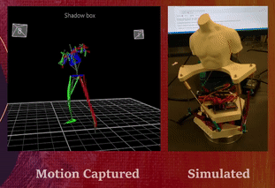

#  Stewart Platform 6DOF Motion Simulator
This repo is a continuation of my inverse kinematics tutorial of stewart platforms https://github.com/Yeok-c/Stewart_Py. 

### Jupyter Notebook
The Jupyter Notebook shows how to stream data with Serial to an ESP32 connected to a PCA6835 to control the servo motors.

### CAD Files
Cad files can be found in the stl_files folder

### ESP32 Code
ESP32 code can be found in esp32_code folder. It is written in Arduino IDE and it acts as an in between MCU to transmit I2C data to the servo controller

### BOM 
The BOM can be found here [BOM LIST](https://docs.google.com/spreadsheets/d/e/2PACX-1vQ9ZVM9ew8fbI84-LNXgIDaTvX_brs-90LQoCqm5XGSu8JCmCOap9srNGCI_uXR5SvpOechf7BhsR9P/pubhtml), links I used for purchase are provided as well. I'm based in Hong Kong so the links are from Taobao - even if you can't purchase from the same source, I hope the pictures and model numbers would be useful for your search for components. 
